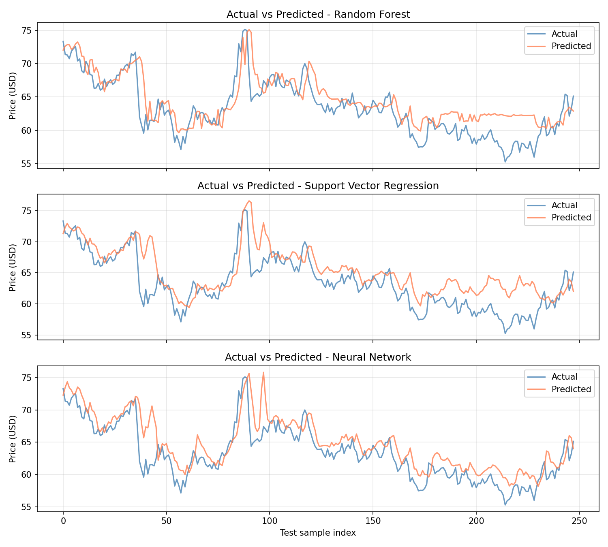

# Oil Price Predictor

A small Python app that predicts the next day’s closing price of WTI crude oil using historical data and simple machine learning models.

## What it does

- Fetches several years of oil price data (Yahoo Finance).
- Builds features from past prices (lags, moving averages, volatility).
- Trains three models: Random Forest, Support Vector Regression, and a small Neural Network.
- Evaluates them on a held-out test period and prints metrics (MAE, RMSE, R²).
- Saves a plot of actual vs predicted prices to the `output` folder.
- Prints a one-step-ahead forecast for the next trading day.

## Screenshots

**Actual vs predicted prices** (test set) — one subplot per model:



**Example terminal output:**

```
============================================================
  Oil Price Prediction App
============================================================
Fetching data for CL=F from 2021-02-05 to 2026-02-04...
Downloaded 1256 records.

Train samples: 988, Test samples: 248
Features: ['close_lag_1', 'close_lag_5', 'close_lag_10', 'sma_5', 'sma_20', 'volatility_10', 'range_5']

Model performance (test set):
  Random Forest: MAE=2.07, RMSE=2.73, R²=0.58
  Support Vector Regression: MAE=2.45, RMSE=3.25, R²=0.40
  Neural Network: MAE=2.01, RMSE=2.63, R²=0.61

Best model by R²: Neural Network (R² = 0.61)

Generating plot...
Saved: output/actual_vs_predicted.png

--- Next trading day closing price prediction (Random Forest) ---
  Predicted next close: $62.90 USD
---
Done. Plot saved: output/actual_vs_predicted.png
============================================================
```

## Run it

```bash
python3 -m pip install -r requirements.txt
python3 oil_price_predictor.py
```

## Requirements

See `requirements.txt`. Main ones: pandas, numpy, scikit-learn, matplotlib, yfinance.
